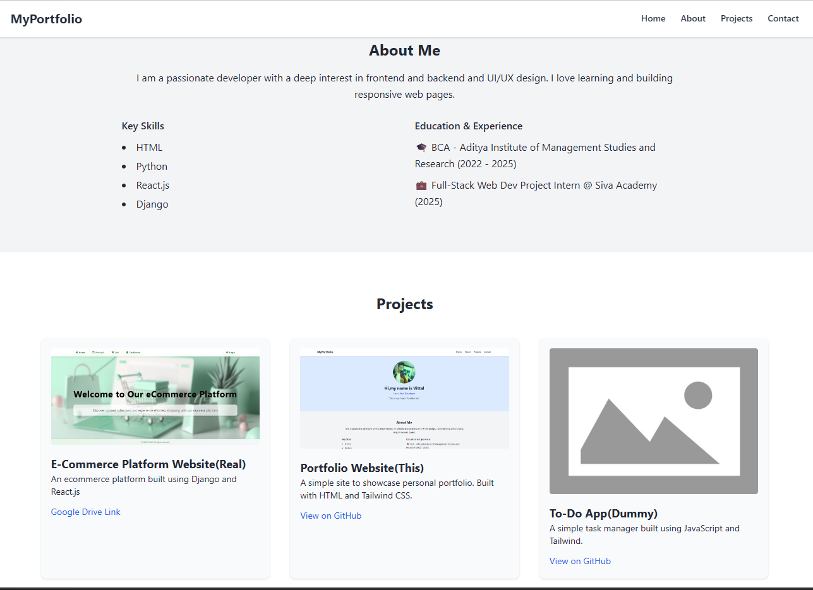

# Responsive Portfolio Website

A simple responsive portfolio website built using HTML, CSS, and Tailwind CSS.

## Features ✨
- Responsive layout
- Modern UI
- Tailwind CSS styling
- Clean design

## Tech Stack 🛠️
- HTML5
- CSS3
- Tailwind CSS

## Future Improvements ⚡
- Dark mode
- Contact form
- React version

## Screeenshots 📸
### Home Page

### About Me and Projects

## Author

**Vittal J G**

GitHub: https://github.com/Vittal-17
